# Subrepo Management

Detect and synchronize nested repositories (subrepos) shared across multiple parent repos.

## Table of Contents

- [What are Subrepos?](#what-are-subrepos)
- [Key Concepts](#key-concepts)
  - [Drift Detection](#drift-detection)
  - [Visual Indicators](#visual-indicators)
  - [Sync Score](#sync-score)
  - [Sync Target Algorithm](#sync-target-algorithm)
- [Commands](#commands)
  - [repos subrepo validate](#repos-subrepo-validate)
  - [repos subrepo status](#repos-subrepo-status)
  - [repos subrepo sync](#repos-subrepo-sync)
  - [repos subrepo update](#repos-subrepo-update)
- [Common Workflows](#common-workflows)
- [Tips](#tips)

## What are Subrepos?

Subrepos are nested Git repositories within parent repos - directories containing their own `.git` folders. When the same subrepo (identified by remote URL) appears in multiple parent repos, it can drift to different commits, creating synchronization problems.

**Built-in drift detection:** `repos push` automatically checks for drift after pushing and displays a concise summary. For detailed analysis and sync tools, use the commands below.

## Key Concepts

### Drift Detection

**Drift** occurs when the same subrepo is at different commits across parent repositories. Detection features:

- Groups subrepos by **remote URL** (not name) to avoid false positives
- Calculates a **sync score** (0-100%) showing synchronization level
- Uses **problem-first output** - shows only drifted subrepos by default
- Provides smart sync suggestions based on commit state

### Visual Indicators

| Indicator | Meaning |
|-----------|---------|
| → | Points to recommended sync target (latest clean commit) |
| ✅ clean | No uncommitted changes |
| ⚠️ uncommitted | Has uncommitted changes |
| ⬆️ LATEST | Absolute newest commit |
| (outdated) | Commit is older than the latest |

### Sync Score

Shows how well synchronized your subrepos are: **100%** means all instances are at the same commit, **0%** means maximum drift.

### Sync Target Algorithm

The tool automatically selects a **SYNC TARGET** using this logic:

1. **Find latest clean commit** - Newest commit without uncommitted changes
2. **Use commit timestamps** - Compares actual commit dates, not checkout order
3. **Prefer clean over latest** - A slightly older clean commit beats the newest dirty one
4. **Mark separately** - Shows both → (recommended sync target) and ⬆️ LATEST (absolute newest)

This ensures sync suggestions are safe and reversible.

```mermaid
graph TD
    A[Detect Subrepos] --> B{Same Remote URL?}
    B -->|Yes| C[Group Instances]
    B -->|No| D[Separate Groups]
    C --> E[Compare Commits]
    E --> F{All Same Commit?}
    F -->|Yes| G[100% Synced ✅]
    F -->|No| H[Calculate Drift]
    H --> I{Has Uncommitted?}
    I -->|Yes| J[Find Latest Clean Commit]
    I -->|No| K[Mark Latest as Target]
    J --> L[Mark with → arrow]
    K --> L
    L --> M[Suggest Sync Command]
```



## Commands

### repos subrepo validate

Discover all nested repositories in your managed repos.

```bash
repos subrepo validate
```

**Output:**
- Total nested repos found
- Number of shared subrepos (appear in multiple parents)
- Number of unique remote URLs
- Grouped by remote URL

### repos subrepo status

Show drift detection for shared subrepos.

| Flag | Description |
|------|-------------|
| `--all` | Show all subrepos, including perfectly synced ones |

```bash
repos subrepo status           # Show only drifted subrepos
repos subrepo status --all     # Show all subrepos
```

**Example output:**

```
🔍 Analyzing 3 shared subrepos...

━━━━━━━━━━━━━━━━━━━━━━━━━━━━━━━━━━━━━━━━━━━━━━━━━━━━━━━━━━━━━━━━━━━━━
🔴 SUBREPO DRIFT (1)
━━━━━━━━━━━━━━━━━━━━━━━━━━━━━━━━━━━━━━━━━━━━━━━━━━━━━━━━━━━━━━━━━━━━━

docs-engine
  Remote: https://github.com/example/docs-engine
  Sync Score: 50% (2 commits across 3 repos)

→ abc1234  project-a                      ✅ clean  ⬆️ LATEST
→ abc1234  project-b                      ✅ clean  ⬆️ LATEST
  def5678  project-c                      ⚠️ uncommitted  (outdated)

  💡 EASY FIX (Recommended):
     repos subrepo sync docs-engine --to abc1234 --stash
     (Syncs 'project-c' to the clean commit from 'project-a')

  🔥 FORCE FIX (Discards changes in 'project-c'):
     repos subrepo sync docs-engine --to abc1234 --force

━━━━━━━━━━━━━━━━━━━━━━━━━━━━━━━━━━━━━━━━━━━━━━━━━━━━━━━━━━━━━━━━━━━━━
💡 2 subrepos fully synced (100%)
   Use --all to see them
━━━━━━━━━━━━━━━━━━━━━━━━━━━━━━━━━━━━━━━━━━━━━━━━━━━━━━━━━━━━━━━━━━━━━
```

**Visual Guide**:
- The arrow `→` points to the commit you should sync to (latest clean)
- `⬆️ LATEST` marks the absolute newest commit
- `(outdated)` indicates commits older than the latest

### repos subrepo sync

Sync a subrepo to a specific commit across all parent repositories.

| Flag | Description |
|------|-------------|
| `--to <commit>` | Target commit hash (required) |
| `--stash` | Stash uncommitted changes (safe, reversible) |
| `--force` | Force sync, discarding uncommitted changes |

**Note:** If both `--stash` and `--force` are provided, `--stash` takes precedence.

```bash
repos subrepo sync my-lib --to abc1234           # Sync (fails if uncommitted)
repos subrepo sync my-lib --to abc1234 --stash   # Safe sync (stashes changes)
repos subrepo sync my-lib --to abc1234 --force   # Force sync (discards changes)
```

**Example output:**

```
🔄 Syncing docs-engine to abc1234...

  ✅ project-a
  ✅ project-b
  ✅ project-c

━━━━━━━━━━━━━━━━━━━━━━━━━━━━━━━━━━━━━━━━━━━━━━━━━━━━━━━━━━━━━━━━━━━━━
📊 Sync Summary
   ✅ 3 synced
   📦 1 stashed (changes saved, run 'git stash pop' to restore)
━━━━━━━━━━━━━━━━━━━━━━━━━━━━━━━━━━━━━━━━━━━━━━━━━━━━━━━━━━━━━━━━━━━━━
```

### repos subrepo update

Update a subrepo to the latest commit from `origin/main` across all parents.

| Flag | Description |
|------|-------------|
| `--force` | Force update even with uncommitted changes |

```bash
repos subrepo update my-lib         # Update to origin/main
repos subrepo update my-lib --force # Force update
```

Tries `origin/HEAD`, then `origin/main`, then `origin/master` to determine latest.

## Common Workflows

### 1. Detecting Drift

```bash
# See only drifted subrepos
repos subrepo status

# See full status (all subrepos)
repos subrepo status --all
```

### 2. Safe Synchronization

When subrepos have uncommitted changes, use `--stash`:

```bash
# Stash changes, sync, then manually pop stash if needed
repos subrepo sync docs-engine --to abc1234 --stash

# Later, in the affected repo:
cd path/to/parent-repo/docs-engine
git stash pop  # Restore changes if desired
```

### 3. Force Synchronization

When you want to discard uncommitted changes:

```bash
repos subrepo sync docs-engine --to abc1234 --force
```

**Warning:** This permanently discards local changes!

### 4. Update to Latest

Instead of syncing to a specific commit, update all instances to `origin/main`:

```bash
repos subrepo update docs-engine
```

This fetches the latest from remote and syncs all instances to it.

### 5. Understanding Sync Scores

- **100%** = All instances at same commit (perfectly synced)
- **50%** = Half synced, half drifted (e.g., 3 instances, 2 commits)
- **0%** = All instances at different commits (maximum drift)

Lower scores indicate more drift and higher priority for synchronization.

## Tips

1. **Use `repos push` for automatic checks** - Get push results + drift detection in one command
2. **Use `--all` sparingly** - Default output focuses on problems that need fixing
3. **Follow the arrow →** - It points to the safest commit to sync to (latest clean)
4. **Prefer `--stash` over `--force`** - Changes can be recovered with `git stash pop`
5. **Check sync scores** - Lower scores need immediate attention
6. **Groups by remote URL** - Subrepos with same name but different remotes are treated separately

---

**Related Documentation:**
- [Documentation Index](../README.md)
- [Getting Started](../getting_started.md)
- [Commands Reference](commands.md)
- [Troubleshooting](troubleshooting.md)
